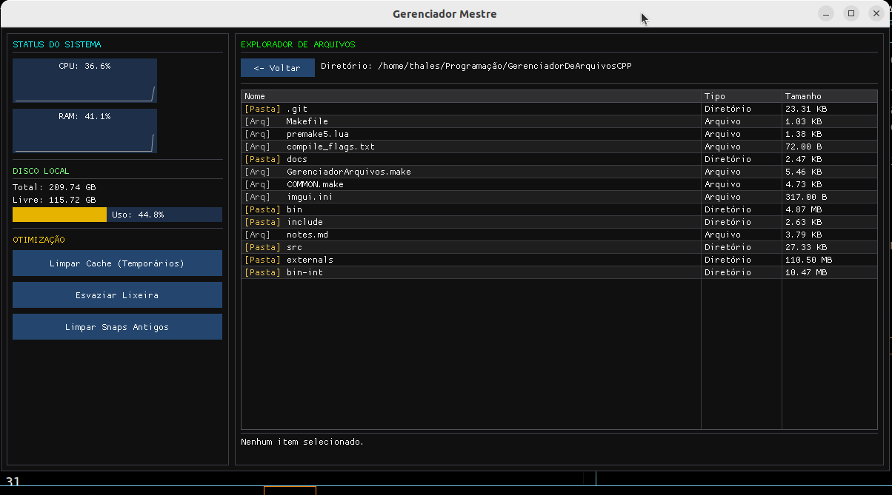

# Gerenciador Mestre 🖥️

O **Gerenciador Mestre** é uma ferramenta de otimização e exploração de arquivos desenvolvida em C++ com a biblioteca gráfica **Dear ImGui** e **OpenGL/GLFW**. Ele foi criado para oferecer uma visão clara do estado do seu sistema Linux e facilitar tarefas comuns de manutenção.

## 🚀 Funcionalidades

### 📊 Monitoramento de Hardware
* **CPU:** Gráfico em tempo real do uso do processador.
* **RAM:** Acompanhamento dinâmico do consumo de memória.
* **Disco:** Exibição clara do espaço total, livre e uso percentual do sistema de arquivos.

### 📁 Explorador de Arquivos
* Navegação intuitiva entre diretórios.
* Identificação visual de arquivos vs. pastas.
* **Segurança:** Sistema de exclusão com confirmação (modal de segurança).

### 🛠️ Otimização do Sistema
* **Limpeza de Cache:** Remova temporários do sistema com um clique.
* **Esvaziar Lixeira:** Limpeza rápida do diretório de lixo do usuário.
* **Limpeza de Snaps:** Remove automaticamente versões antigas (desativadas) de pacotes Snap, liberando espaço significativo em disco de forma segura, com autenticação gráfica única.

---

## 🛠️ Tecnologias Utilizadas
* **Linguagem:** C++ (Padrão 17/20)
* **Interface:** [Dear ImGui](https://github.com/ocornut/imgui)
* **Janelas/Contexto:** [GLFW](https://www.glfw.org/) + [OpenGL](https://www.opengl.org/)
* **Sistema:** Linux (integrado com `pkexec` para privilégios de root)

---

## ⚙️ Como Compilar e Rodar

### Pré-requisitos
Certifique-se de ter as bibliotecas de desenvolvimento instaladas (Exemplo em sistemas baseados em Debian/Ubuntu):

```bash
sudo apt update
sudo apt install build-essential libglfw3-dev libgl1-mesa-dev

Compilação

No terminal, dentro da pasta do projeto:
Bash

# Limpar build anterior
make clean

# Compilar em modo Release para melhor desempenho
make config=release

# Executar
./bin/GerenciadorMestre

🛡️ Segurança e Privacidade

O Gerenciador Mestre foi desenvolvido pensando em transparência.

    A remoção de pacotes Snap utiliza o pkexec, garantindo que você autorize a operação via interface gráfica do seu sistema apenas uma vez por execução.

    A exclusão de arquivos é feita localmente, sem acesso a servidores externos.

🤝 Contribuições

Sinta-se à vontade para abrir uma Issue ou enviar um Pull Request se encontrar algum erro ou quiser sugerir novas funcionalidades para otimização do sistema!

Desenvolvido com C++, café, energético e cerveja . ☕




ScreenShot do menu principal
